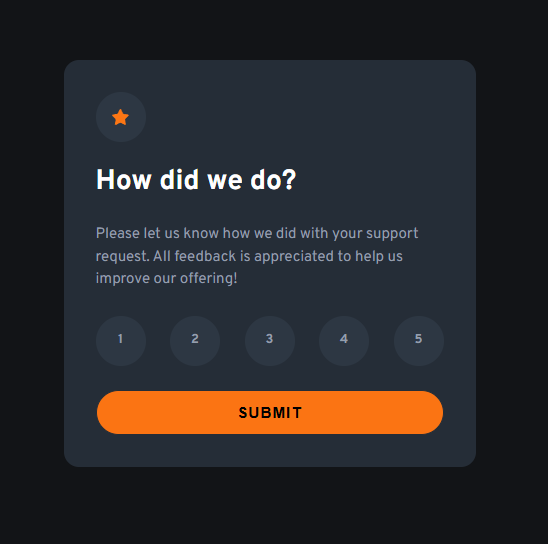

# Frontend Mentor - Interactive rating component solution

This is a solution to the [Interactive rating component challenge on Frontend Mentor](https://www.frontendmentor.io/challenges/interactive-rating-component-koxpeBUmI). Frontend Mentor challenges help you improve your coding skills by building realistic projects. 

## Table of contents

- [Overview](#overview)
  - [The challenge](#the-challenge)
  - [Screenshot](#screenshot)
  - [Links](#links)
- [My process](#my-process)
  - [Built with](#built-with)
  - [What I learned](#what-i-learned)
  - [Continued development](#continued-development)
  - [AI Collaboration](#ai-collaboration)
- [Author](#author)

## Overview

### The challenge

Users should be able to:

- View the optimal layout for the app depending on their device's screen size
- See hover states for all interactive elements on the page
- Select and submit a number rating
- See the "Thank you" card state after submitting a rating

### Screenshot

### Links

- Solution URL: https://github.com/sanei-i/interactive-rating-component
- Live Site URL: https://interactive-rating-component-sanei-i.netlify.app/

## My process

### Built with

- Semantic HTML5 markup
- CSS custom properties
- Flexbox
- CSS Grid
- Mobile-first workflow

### What I learned

In this project, I practiced using CSS custom properties for colors, spacing, and typography. I also learned how to create custom radio buttons using hidden inputs and labels.

With JavaScript, I learned how to:
- use querySelector to get elements
- handle click events with addEventListener
- toggle classes to switch cards
- get the selected radio value using :checked

I also improved my understanding of responsive layouts, flexbox, and utility classes like .hidden.

### Continued development

I want to continue improving my JavaScript skills, especially DOM manipulation and handling user interactions. I also want to get more comfortable building responsive layouts and organizing CSS with reusable utility classes and custom properties.

### AI Collaboration

I used AI to better understand JavaScript concepts like event handling, DOM manipulation, and class toggling. I also used it to learn more about CSS properties, naming conventions, and responsive styling while building the project.

## Author

- GitHub - [sanei-i](https://github.com/sanei-i)
- Frontend Mentor - [sanei-i](https://www.frontendmentor.io/profile/sanei-i)
